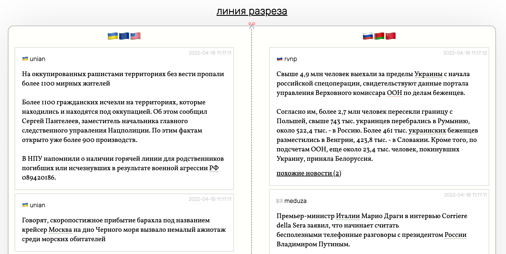

# liniarazreza*

Hi hello, this is a tiny news aggregator which helps to understand the difference between ukrainian and russian sources during the war. For now, the source can be either an RSS or a Telegram channel, please refer to `config.yaml`.

## what's inside

* `pymorphy` for word normalizing, POS tagging and some NER
* `python-levenshtein` & `fuzzywuzzy` for similar news search
* `FastAPI` for serving this all

## how to run

```
docker-compose build
docker-compose up

# then open localhost:8000 in your browser
```



\* linia razreza means "the cutting line" in Russian
